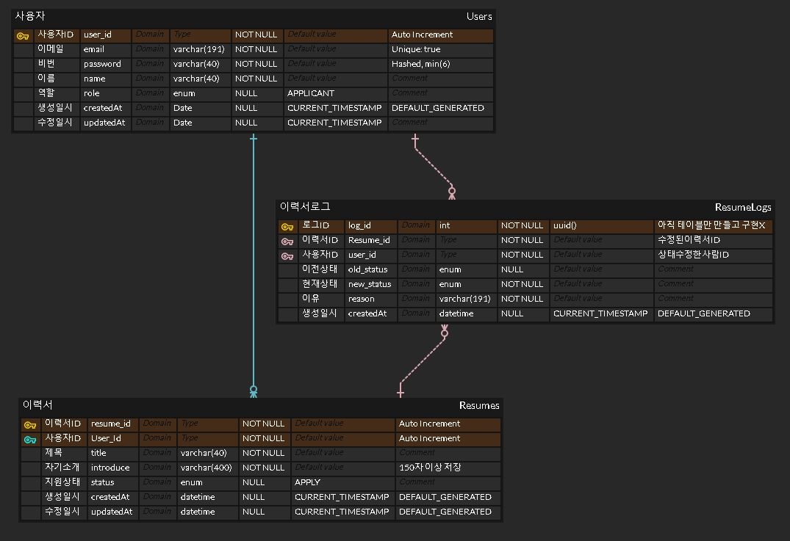

# PersonalProject3

## 🏁 목표

"Express.js, MySQL을 활용해 나만의 채용 서비스 백엔드 서버 만들기"

## 📚 학습 과제 완료 시 할 수 있는 것

1. **API 명세서를 작성**하여 프론트엔드 개발자와 원활히 협업
2. **ERD를 작성**하여 RDB(MySQL)를 이용한 데이터 모델링
3. **MySQL, Prisma**를 이용해 데이터베이스를 설계하고 활용
4. **JWT, Middleware**를 활용해 인증과 인가 기능 구현
5. **Transaction**의 동작 방식과 활용처를 알고 직접 구현
6. **AWS EC2**에 Express.js를 이용한 웹 서비스 배포

## 🛠 기술 스택

- **웹 프레임워크**: Express.js
- **패키지 매니저**: Yarn (또는 NPM)
- **모듈 시스템**: ESM (ES6 모듈 시스템)
- **데이터베이스**: MySQL (AWS RDS)
- **ORM**: Prisma
- **인증**: JWT (JSON Web Token)

## 📂 프로젝트 구조

```markdown
PP3RESUME-HUB
├── prisma
│   ├── schema.prisma
│   └── migrations
├── src
│   ├── constants
|   |   ├── auth.constant.js
|   |   ├── env.constant.js
|   |   ├── resume.constant.js
|   |   └── user.constant.js
│   ├── middlewares
|   |   ├── authentication.middleware.js
|   |   ├── authorization.middleware.js
|   |   ├── error-handling.middleware.js
|   |   ├── log.middleware.js
|   |   └── validators
|   |       ├── listResumes.validator.js
|   |       ├── postResume.validator.js
|   |       ├── signup.validator.js
|   |       ├── singin.validator.js
|   |       └── updateResume.validator.js
│   ├── routers
│   │   ├── resumes.router.js
│   │   └── users.router.js
│   ├── utils
|   |   └── prisma.index.js
│   └── app.js
├── .env
├── .gitignore
├── .prettierrc.json
├── package.json
├── yarn.lock
└── README.md
```

## 🚀 설치 및 실행 방법

### 1. 프로젝트 클론

```
git clone https://github.com/yourusername/PersonalProject3.git
cd PersonalProject3
```

### 2. 의존성 설치

```
yarn init -y
```

### 3. 환경 변수 설정

`.env` 파일을 생성하고 다음 내용을 추가합니다:

```env
SEVER_PORT=3015
DATABASE_URL="your-database-url"
```

### 4. 데이터베이스 마이그레이션

```
npx prisma migrate dev --name init
```

### 5. 서버 실행

```
yarn run start 
```

## 📋 API 명세서

[Node.js 숙련주차 API 명세서](https://torch-consonant-c1e.notion.site/Node-js-API-cbc293b58e844844a9e36d1c6ef7a3ee?pvs=4)

## 📑 ERD (Entity Relationship Diagram)



## 🔒 인증 및 인가

- **JWT**를 사용하여 인증 및 인가를 처리합니다.
- **Middleware**를 활용하여 인증 및 역할 기반 인가를 구현합니다.

## 🧩 트랜잭션

- 데이터베이스 트랜잭션을 활용하여 데이터 일관성을 보장합니다.
- Prisma의 트랜잭션 API를 사용하여 구현합니다.

## 🌐 배포

- **AWS EC2**에 Express.js 웹 서비스를 배포합니다.

## 🛠 개발 환경

- Node.js v14 이상
- Yarn 1.x 이상
- MySQL 8.x 이상
- Prisma 2.x 이상

## 📬 문의

- 프로젝트 관련 문의는 gangsan1414@gmail.com으로 연락주세요.
